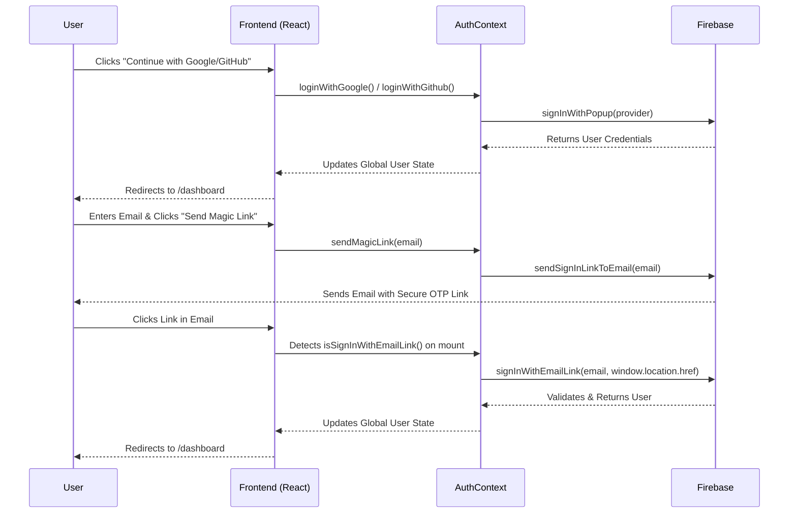

# AuthPage Studio

A refined, production-ready authentication flow built with React, Vite, TypeScript, and Firebase. This project focuses on delivering a premium user experience while maintaining robust, modern security standards.


## 📖 About the Project

AuthPage Studio is designed as a foundational boilerplate for applications requiring high-security, enterprise-grade authentication interfaces. It goes beyond the standard "email and password" forms by integrating multiple robust authentication strategies natively into a luxury, minimalist UI.

### Core "Roots" and Philosophy
- **Security First:** Leveraging Firebase Authentication's modular SDK to ensure tokens, passwords, and sessions are managed securely.
- **Progressive Enhancement:** Users can authenticate via traditional methods or utilize frictionless passwordless magic links.
- **Type Safety:** The entire application is strictly typed using TypeScript, catching potential runtime errors during development.
- **Design Excellence:** Utilizing Tailwind CSS to create a responsive, dark-mode compatible interface that feels premium and thoughtful.

## ✨ Features

- **Google Authentication:** Seamless one-click sign-in with Google.
- **GitHub Authentication:** Developer-friendly authentication via GitHub.
- **Passwordless Magic Links:** Secure, one-time OTP email links for frictionless login.
- **Password Recovery:** Built-in secure password reset flow.
- **Form Validation:** Client-side validation using React Hook Form and Zod.
- **Luxury UI/UX:** Fully responsive, premium interface built with Tailwind CSS.
- **Dark Mode Ready:** Automatically adapts to user system preferences.

## 🔄 Authentication Flow

Below is a high-level sequence diagram illustrating the architecture of our authentication strategies:



## 🌳 Project Structure & Files

The project is structured for scalability and maintainability. Here is the complete file and directory tree of the application:

```text
.
├── public/                       # Public static assets served at the root path
│   ├── favicon.svg               # Application favicon
│   └── icons.svg                 # SVG sprite for icons
├── skills/                       # Claude Code skills and AI assistant documentation
│   ├── frontend-ui-ux-skill.md
│   ├── plan-skill.md
│   ├── react-auth-skill.md
│   └── SKILL.md
├── src/                          # Application source code
│   ├── assets/                   # Local static assets bundled by Vite
│   │   ├── hero.png
│   │   ├── react.svg
│   │   └── vite.svg
│   ├── components/               # Reusable UI components
│   │   └── ProtectedRoute.tsx    # Higher-order component for route guarding
│   ├── context/                  # React Context providers
│   │   └── AuthContext.tsx       # Core Firebase authentication logic & global state
│   ├── hooks/                    # Custom React hooks directory
│   ├── lib/                      # Third-party library initializations
│   │   └── firebase.ts           # Firebase SDK setup and provider exports
│   ├── pages/                    # Route-level components
│   │   ├── AuthActionPage.tsx    # Handles Magic Links and Password Resets
│   │   ├── Dashboard.tsx         # Protected user dashboard
│   │   ├── LoginPage.tsx         # Sign-in interface (Email, Google, GitHub, Magic Link)
│   │   └── SignupPage.tsx        # Registration interface
│   ├── App.css                   # Global app styles
│   ├── App.tsx                   # Main application routing layer
│   ├── index.css                 # Base CSS and Tailwind directives
│   └── main.tsx                  # React DOM entry point
├── .env.local                    # Environment variables (ignored by Git)
├── .gitignore                    # Git ignored files configuration
├── CLAUDE.md                     # AI assistant instructions for the project
├── eslint.config.js              # ESLint configuration
├── index.html                    # Vite HTML entry point
├── LICENSE                       # Project license
├── package.json                  # NPM dependencies and scripts
├── postcss.config.js             # PostCSS configuration for Tailwind
├── tailwind.config.js            # Tailwind CSS configuration
├── tsconfig.app.json             # TypeScript configuration for the app
├── tsconfig.json                 # Base TypeScript configuration
├── tsconfig.node.json            # TypeScript configuration for Node/Vite
├── vercel.json                   # Vercel deployment configuration
└── vite.config.ts                # Vite bundler configuration
```

### Key Technologies

- **Frontend:** React 19 (Hooks), TypeScript, Vite
- **Styling:** Tailwind CSS, Lucide React (Icons)
- **State Management & Routing:** React Context API, React Router v7
- **Validation:** React Hook Form + Zod
- **Notifications:** React Hot Toast
- **Backend/Auth:** Firebase Authentication (v12 modular SDK)

## 🚀 Getting Started

### 1. Clone the repository
```bash
git clone <repository-url>
cd Auth-Page
```

### 2. Install dependencies
```bash
npm install
```

### 3. Setup Firebase
You will need to create a project in the [Firebase Console](https://console.firebase.google.com/) and enable the following Sign-in providers under **Build > Authentication**:
- **Google**
- **GitHub** (Requires setting up an OAuth App in your GitHub Developer Settings)
- **Email/Password** (Required for the Password Reset flow)
- **Email link (passwordless sign-in)** (Required for the Magic Link flow)

### 4. Configure Environment Variables
Create a `.env.local` file in the root directory and add your Firebase configuration details:

```env
VITE_FIREBASE_API_KEY=your_api_key
VITE_FIREBASE_AUTH_DOMAIN=your_project_id.firebaseapp.com
VITE_FIREBASE_PROJECT_ID=your_project_id
VITE_FIREBASE_STORAGE_BUCKET=your_project_id.appspot.com
VITE_FIREBASE_MESSAGING_SENDER_ID=your_messaging_sender_id
VITE_FIREBASE_APP_ID=your_app_id
```

### 5. Start the development server
```bash
npm run dev
```

Navigate to `http://localhost:5173` to view the application.

## 📜 Commands

- `npm run dev` - Starts the Vite development server
- `npm run build` - Builds the application for production
- `npm run preview` - Previews the production build locally
- `npm run lint` - Runs ESLint to check for code issues

## 🤝 Contributing

Contributions are welcome! Please feel free to submit a Pull Request.

## 📄 License

© 2026 AuthPage Studio. All rights reserved.